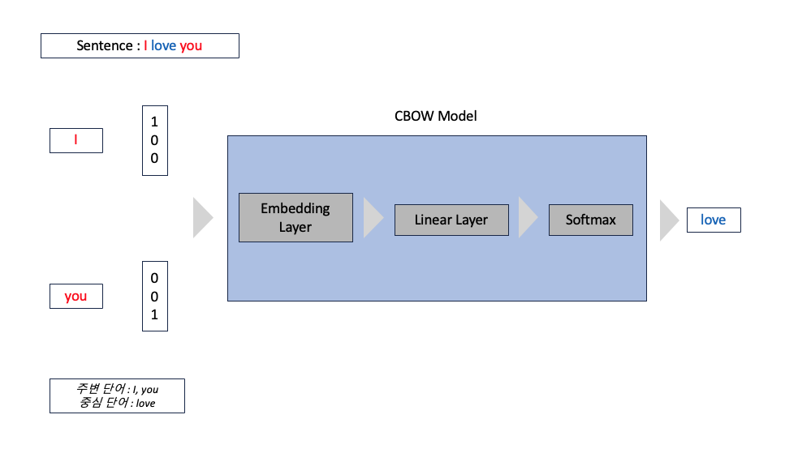

# Word2Vec in PyTorch

## Overview

기존의 단어를 표현하는 방식은 **희소표현(Sparse Representation)** 으로 이루어 졌다. 대표적으로 원-핫 인코딩(One-Hot Encoding) 방식으로 단어를 표현하거나 BoW(Bag of Word)와 같은 방식으로 문서를 표현해 왔다.

**분산표현(Distributed Representation)** 은 기본적으로 *비슷한 문맥에서 등장하는 단어들은 유사한 의미를 가진다.* 라는 가정을 하에 단어를 표현하는 방법이다.

문맥의 관계로 단어들을 특정 벡터로 표현하게 된다면 기존의 단어 집합(vocabulary)의 크기 만큼 희소벡터로 표현할 필요가 없다.

```
Sparse Representation      >>  Cat = [0, 1, 0, 0, 0, 0, 0 ...]
Distributed Representation >>  Cat = [0.1, 0.02, 0.3, 0.7]
```

단어를 여러 차원의 분산표현으로 나타내게 된다면, **단어의 간의 유사도** 를 계산할 수 있는데 이를 위한 대표적인 방법이 Word2Vec 이다.

## Word2Vec


### CBOW


<br>

Word2Vec의 학습 방식 중 CBOW(Continuous Bag of Words)는 주변 단어로 부터 중심 단어를 추론하는 방식으로 학습된다.




### Skip-gram


<br>

Skip-gram 방식은 중심 단어로 부터 주변 단어를 추론하는 방식으로 학습된다.


## Usage

```
python3 main.py --device [device] --mode [mode] --config [config]
```

- --device : cpu 또는 mps 장치 정의

- --mode : train 또는 test 정의

- --config : config.json의 위치 정의

## Data

네이버 영화 리뷰 데이터